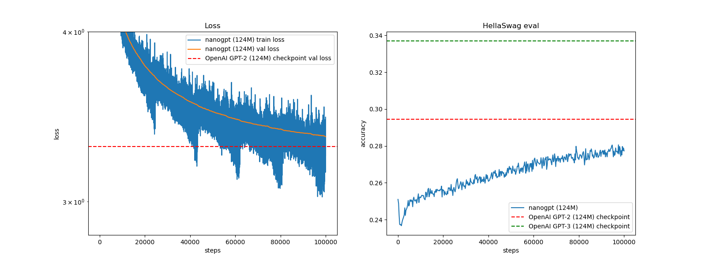

# README
## Overview

**Date:** 2025-01-29

We have coded the implementation of GPT-2 from Andrej Karpathy's [video](https://www.youtube.com/watch?v=l8pRSuU81PU&t) using PyTorch and trained the model from scratch using a cluster of 8 NVIDIA H100s.

## Current Best Performance

- **Min Train Loss**: 3.023382
- **Min Validation Loss**: 3.349121
- **Max Hellaswag Eval**: 0.2806
- **Training Time**: 5Hrs on 8 H100s


## Replication Guide

### Installation

1. **Clone the repository:**

   ```bash
   git clone https://github.com/itsnemoooo/train-llms
   ```

2. **Install dependencies:**

   ```bash
   pip install -r requirements.txt
   ```
3. **Generate the input dataset:**

   ```bash
   python huggingface.py
   ```
## Training the model

1. **Train from scratch with DDP:**

    ```bash
    torchrun --standalone --nproc-per-node=8 main.py
    ```

#### Evaluation

The model can be evaluated on the HellaSwag dataset by running the evaluation loop included in the training script. The evaluation results, including validation loss and HellaSwag accuracy, are logged to `log/log.txt`.

## Collaboration 🤝

Contributions to this project are encouraged. Please follow these steps to contribute:

1. **Fork the repository**.
2. **Create a new branch** for your feature / fix.
3. **Commit your changes** with clear and concise messages.
4. **Push to your branch** and create a PR.

## License

This project is licensed under the MIT License. See the `LICENSE` file for more details.

---

For any questions or issues, please open an issue on the GitHub repository or contact the project maintainers.
